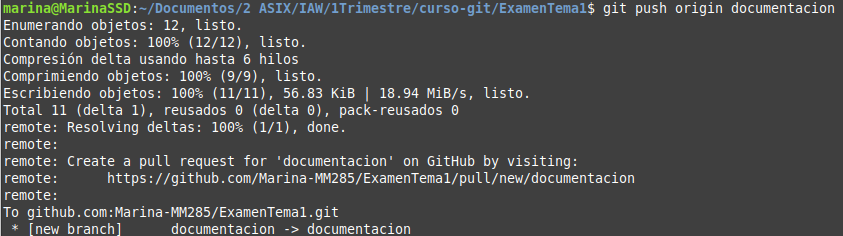

#Compartir y actualizar proyectos
--------------------------------------------------------------------------------------------
## git push
* Envía cambios al repositorio remoto (en la rama actual)

* Con origin [nombre de la rama]
	* Envía una rama local al repositorio remoto

* Con -u origin [nombre de la rama]
	* Envía cambios al repositorio remoto (y te posiciona en la rama concreta)

* Con origin --delete [nombre de la rama]
	* Elimina una rama remota

--------------------------------------------------------------------------------------------

## git pull
* Actualiza el repositorio local al último commit enviado

* Con origin [nombre de la rama]
	* Trae / agarra todos los cambios de un repositorio remoto

--------------------------------------------------------------------------------------------

##git remote
* Con add origin ssh://git@github.com/[nombreDeUsuario]/[nombre-del-repo].git
	* Añade cambios a un repositorio remoto

* Con set-url origin ssh://git@github.com/[nombreDeUsuario]/[nombre-del-repo].git
	* Ubica la rama remota de un repositorio remoto mediante su SSH

