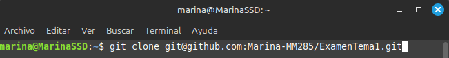
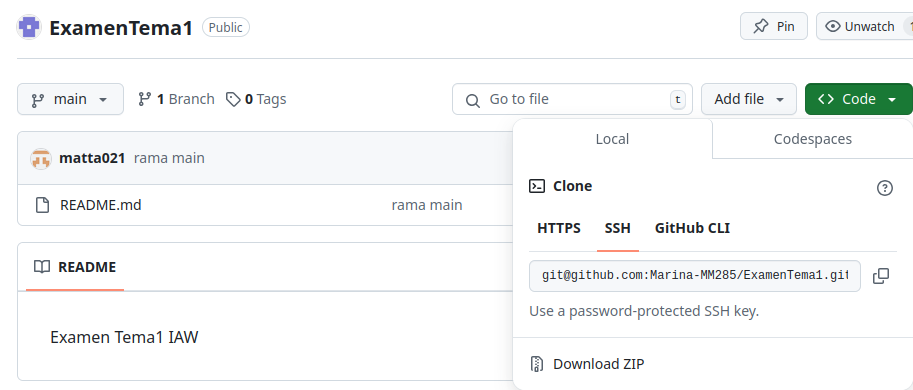
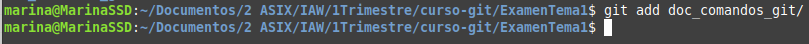
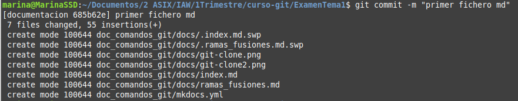

# Comandos básicos

--------------------------------------------------------------------------------------------

##Conseguir y crear proyectos
#### git init

* Inicializa un repositorio local de Git

#### git clone
* Crea una copia local de un repositorio remoto y va a acompañado de: 
	* ssh://git@github.com/[nombreDeUsuario]/[nombre-del-repo].git

* La ruta la sacamos de nuestro repositorio en GitHub

--------------------------------------------------------------------------------------------

##Comandos base
####git status
* Comprueba el status actual

####git add
* Añade un archivo a la zona de subir cambios y va acompañado del nombre de un archivo

* Puede llevar un -A
	* Añade todos los archivos del repositorio a la zona de subir cambios

####git commit -m
* Crea un mensaje explicativo de los cambios
* Le pondremos simpre el nombre del commin entre comillas
	* git commit -m "*nombre_commit*"

####git rm -r
* Elimina un archivo (o carpeta) y va acompañado del nombre de dicho archivo (o carpet)

--------------------------------------------------------------------------------------------

##Saber más
* Si quieres tener una axplicación mas detallada de como funcionan los comandos de git
mira esta página
[Comandos básicos de GitHub](https://www.atlassian.com/es/git/glossary#commands)

