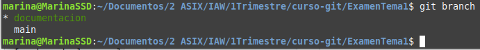
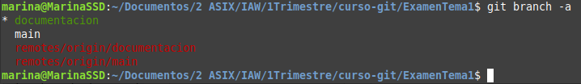

#Ramas y fusiones
--------------------------------------------------------------------------------------------
## git branch
* Muestra una lista de las ramas que existen en este proyecto
(el asterisco señala la rama activa)

* Con el -a
	* Muestra una lista de todas las ramas (locales y remotas)

* Especificando un nombre
	* Crea una nueva rama
		* git branch *nombre_rama*

* Con el -d
	* Elimina una rama local 	

* Con el -m [nombre de la rama antigua] [nombre de la rama nueva]
	* Renombra una rama local

--------------------------------------------------------------------------------------------

##git push
* git push origin --delete [nombre de la rama]
	* Elimina una rama remota

--------------------------------------------------------------------------------------------

## git checkout 
* Cambia a una rama concreta

* Con un -
	* Cambia a la última rama activa

* Con -b [nombre de la rama]
	* Crea una nueva rama y nos desplaza hasta ella

* Con -b [nombre de la rama] origin/[nombre de la rama]
	* Clona una rama remota y nos desplaza hasta ella

* Con -m [nombre de la rama antigua] [nombre de la rama nueva]

--------------------------------------------------------------------------------------------

## git merge
* Combina una rama concreta con la rama activa

* Con [nombre de la rama de origen] [nombre de la rama de destino]
	* Combina una rama concreta (rama de origen) con una rama nueva (rama de destino)

--------------------------------------------------------------------------------------------

## git stash
* Revierte los últimos cambios y errores en el directorio actual

* Con clear
	* Revierte todos los cambios en el directorio actual
